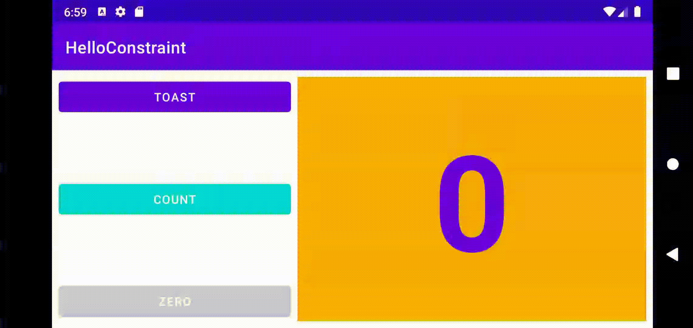
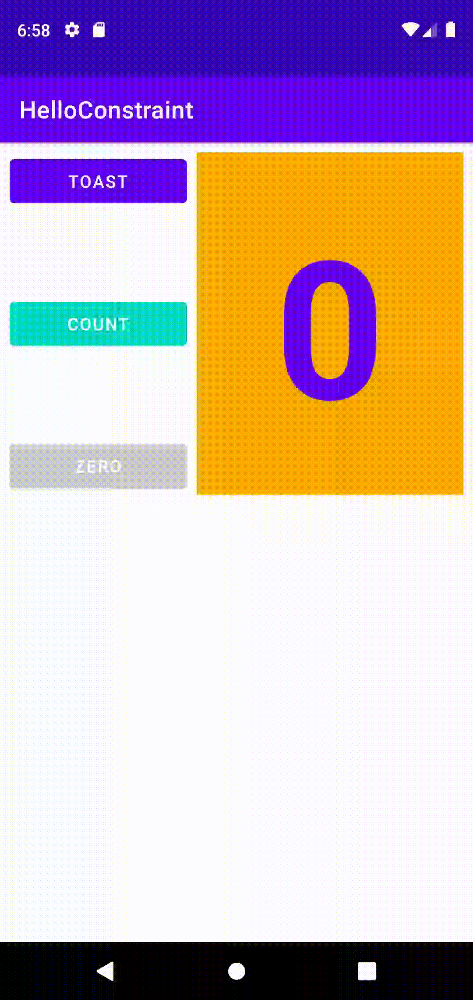
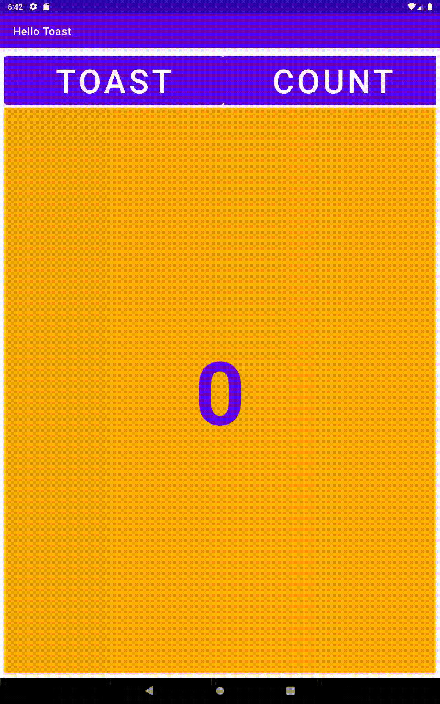

# Week 2 - Homework

The homework for this week was to make some additional changes to the previous week's tasks.
The changes included variations to the layout across different orientations/sizes and also adding an extra feature that would change the current count to 0.

## Horizontal Layout - Normal Screen

## Vertical Layout - Normal Screen

## Horizontal Layout - Tablet Screen

## Vertical Layout - Tablet Screen

