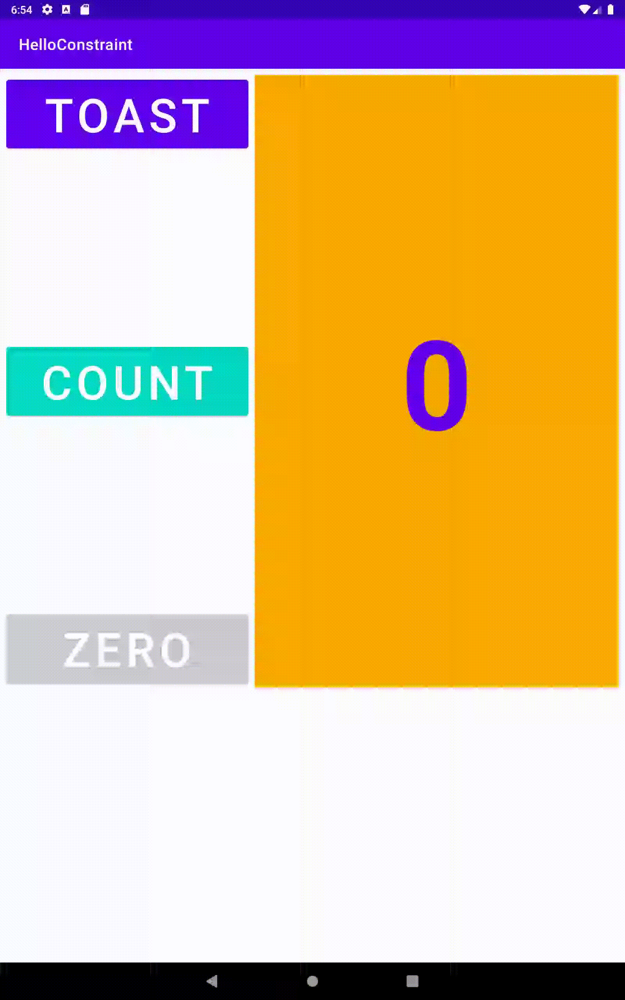
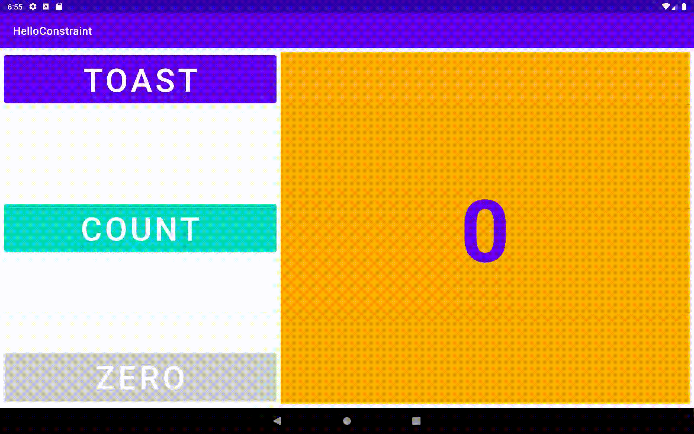

# Week 2 - Task

The task for this week was to create layout variations to support different orientations (landscale/portrait) across different screen sizes so that
the layout looked consistent across all devices.

## Horizontal Layout - Normal Screen

## Vertical Layout - Tablet Screen

## Horizontal Layout - Tablet Screen

## Vertical Layout - Tablet Screen using Relative Layout

